# Принципы современного игрового ИИ

Совершенно случайно наткнулся на [ссылку][course]  на этот курс. Разработкой ИИ
(главным образом для игр) я интересуюсь - до сего момента весьма поверхностно -
достаточно  давно, так  что с  удовольствием подписался.  Благо что  бесплатная
регистрация  ещё была  доступна. О  преподавателе курса  я уже  кое-что знаю  -
однажды  посоветовали его  [книжку][book] по  теме, и  отзывались о  ней весьма
положительно  (до неё  я, впрочем,  так и  не добрался);  кроме того,  он автор
популярного среди разработчиков игрового ИИ портала [aigamedev.com][aigamedev].

Курс  рассчитан на  12 недель,  с лабораторными  работами (которые  предлагается
выполнять  на Питоне)  и промежуточным  тестированием -  в общем,  как положено.
Дабы  лучше   усвоить  изучаемый  материал,   я,  помня  о   мощи  интервального
запоминания,  решил  его  конспектировать,  по  памяти,  спустя  день-два  после
просмотра. Посмотрим, как пойдёт, и хватит ли мне времени.

## 0.1 Введение

Коренная идея при  разработке ИИ - воспринимать его  как интерактивного агента,
как  чёрный ящик,  который, обрабатывая  ту или  иную информацию  об окружающем
мире, получаемую на входе, на выход  выдаёт те или иные действия, в зависимости
от целей своего существования.

Здесь агентом  может выступать  любая система,  принимающая решения.  Это может
быть  и одиночный  бот; и  ИИ  полководца, управляющего  армией в  RTS; и  game
director, управляющий  сложностью и  наполнением уровня;  и генератор  музыки в
игре.  В  первом  случае  входом может  служить  информация  о  местонахождении
противника и ближайших укрытий, а выходом  - открытие огня, движение к укрытию,
анимация этого движения;  во втором случае вход - информация  о наличии тех или
иных ресурсов, количестве  армии своей и противника, выход  - команды отдельным
юнитам,  тренировка новых;  в третьем  на вход  может подаваться  информация об
уровне здоровья игрока, доступной амуниции, количестве врагов вокруг, а выходом
будет  являться спавн  новых противников  в том  или ином  количестве, а  также
припасов; в генераторе музыки вход -  опять же, здоровье игрока, наличие врагов
поблизости, а выход - тревожная или, наоборот, спокойная музыка.

Несмотря на то,  что со времён появления индустрии  компьютерных игр технологии
шагнули далеко вперёд  и наши вычислительные возможности  на несколько порядков
превосходят те,  что были раньше,  создание все более реалистичного  ИИ требует
применения  хитростей и  оптимизаций, и  поэтому не  является тем,  что принято
называть "сильным" ИИ; у ИИ для компьютерных игр другие цели, и, как следствие,
другие решения.

## 0.2 Общие определения

Несмотря  на  обилие литературы  по  проектированию  игрового ИИ,  нет  чёткого
определения этого  термина. Так как  сфер применения ИИ и  связанных алгоритмов
множество,  то,   что  подразумевается   под  интеллектом  в   области  научных
исследований  или  индустрии  разработки  ПО   мало  пересекается  с  тем,  что
используется в компьютерных играх.

С  течением  времени  то,   что  когда-то  считалось  областью  "искусственного
интеллекта",   переходит  в   computer   science   как  отдельное   направление
исследований и  перестаёт быть овеяно  неким таинственным ореолом.  Как говорил
[Джон  Маккарти][john], когда  нечто  начинает сносно  работать, оно  перестаёт
относиться к сфере "искусственного  интеллекта". Как следствие, просто относить
к  ИИ  используемые алгоритмы  или  структуры  данных не  является  корректным.
Поэтому использование  в качестве  термина "интерактивный агент"  (ИА) является
более подходящим.

При сравнении требований к интерактивным  агентам с другими типами систем можно
сказать, что первым свойственна:

- высокая степень интерактивности
-  использование  сложных  структур   данных  для  обеспечения  интерактивности
посредством текста, голоса, анимаций и прочего
- немалая степень автономности
- высокая сложность процесса работы

## 0.3 В продакшн!

Главная  цель любой  коммерческой разработки,  к которой  относится и  создание
компьютерных  игр, -  продать товар  и получить  за это  деньги. Следовательно,
компании стремятся  к тому, чтобы путь  от начала разработки до  релиза был как
можно  короче  и экономически  эффективней.  Может  показаться, что  требования
бизнеса  мешают искусству  разработки  игр, но  на самом  деле  всё наоборот  -
жёсткие рамки  помогают сконцентрироваться на  проекте и довести его  до конца.
Разумеется,  порой приходится  изменять  или вообще  отказываться от  некоторых
изначальных задумок с целью успеть в срок или уложиться в бюджет.

Любую комплексную  систему, к  которой относится  и мало-мальски  сложная игра,
невозможно  сделать с  нуля,  нахрапом, от  первоначальной  задумки до  релиза.
Важнейшим  преимуществом и  даже **обязательным**  условием при  разработке игр
является как  можно скорейшее  получение фидбэка от  игроков, с  целью улучшать
продукт с  учётом их интересов.  Поэтому важно получить готовый  к тестированию
продукт (как  совокупность компонентов)  как можно  раньше, чтобы  далее менять
каждый из компонентов постепенно, итерационно. Разработка интерактивных агентов
не является исключением, и о  необходимости получить хоть что-то работающее как
можно раньше говорят многие корифеи индустрии.

Весь срок разработки, который может достигать нескольких лет, принято разбивать
на интервалы,  в конце каждого  из которых игрокам  предоставляется возможность
пощупать  продукт в  его  текущем  состоянии, с  целью  собрать отзывы.  Многие
команды  даже  делают  релизы  еженедельными,  а  некоторые  -  и  ежедневными,
осознавая всю важность как можно более скорого получения обратной связи.

Как уже  было сказано  ранее, к разработке  интерактивных агентов  относится не
только работа  над тем, как они  себя ведут в  окружающем мире, но и  над всеми
остальными  аспектами,  которые  влияют  на  их  реалистичность  и  качество  -
анимацию, звуковое  сопровождение, тестирование  и т. п.  Стоит убрать  один из
этих аспектов - и ИА уже не выглядит так реалистично, что снижает качество игры
и, как следствие, может привести к её финансовому провалу. Поэтому разработчики
интерактивных агентов  работают не  столько над поведением  игровых персонажей,
как может показаться стороннему  наблюдателю, сколько над интеграцией множества
этих аспектов воедино.

Типичный процесс разработки игры состоит из следующих этапов:

- создание *концепта*  в виде дизайн-документа, в  котором описываются основные
идеи игры и её особенности
- *пре-продакшн*,  в котором из  концепта делают то, что  можно в том  или ином
виде пощупать - чаще всего в виде прототипа игры
-  *продакшн*,  основной  период   разработки  игры,  когда  реализуются  фичи,
описанные в концепте, а также пробуются некоторые новые
- на этапе  *альфа-версии* происходит отсеивание некоторых  фич, и концентрация
внимания только над прошедшими отсев
- на этапе *бета-версии* исправляются баги, фичи доводят до готового состояния
- и, наконец, происходит *релиз*

Данный подход работает как для разработки игры  в целом, так и для любого из её
компонентов,  в том  числе, разумеется,  и интерактивных  агентов. Более  того,
хорошей идеей  является ставить  на эти  же рельсы  разработку любой  фичи, где
концептом может являться, например, таск из  трекера или же письмо с отзывом от
игрока, а релизом - слияние фичи с общей кодовой базой игры.

Итеративная  разработка  рулит!  Её,  если угодно,  можно  сравнить  с  научным
подходом,  где  сперва  происходит  наблюдение (выбираем  фичу  из  бэклога  по
приоритету), затем  - делается предположение (набрасываем  дизайн), после этого
готовится эксперимент  (разработка прототипа), после чего  гипотеза проверяется
(прототип уходит на  тестирование). В случае, если гипотеза  не прошла проверку
экспериментом, она  уточняется, и  весь процесс,  за исключением  первого шага,
повторяется. То же самое происходит и при работе над некоторой игровой фичей.

[course]: http://courses.nucl.ai/courses/pmgai/
[book]: http://www.ozon.ru/context/detail/id/3384783/
[aigamedev]: http://aigamedev.com
[john]: https://ru.wikipedia.org/wiki/Маккарти,_Джон

* * *

# Первый урок

В данном уроке рассматриваются то,  как в интерактивных агентах выглядят потоки
информации и  управления, какие есть  стратегии обновления игровых  сущностей в
игровом цикле,  а также приводятся  некоторые подходы к  построению архитектуры
ИА.

## 1.1 Архитектура агента

Классическая схема вычислительного процесса интерактивного агента, пришедшая из
области робототехники, это связка "*ощущаю - думаю - действую*".

На  первом  этапе,  этапе  *ощущений*, агент  собирает,  как-то  преобразует  и
запоминает ту или иную информацию из внешнего мира с помощью специализированных
сенсоров.  На  этапе  *обдумывания* происходит  анализ  накопленной  информации
с  целью  определить,  какие   действия  необходимо  совершить  для  достижения
поставленных  целей.  И, собственно,  после  этого  происходит черёд  совершать
*действия*.

Не  смотря  на кажущуюся  простоту,  любой  из  этих  шагов может  быть  весьма
сложен: при принятии того или  иного решения может потребоваться дополнительная
информация  из окружающего  мира, и  необходимо будет  сделать ещё  один запрос
к  сенсорам;  при  планировании может  использоваться  механизм  предугадывания
результата действий, то  есть будет задействована подсистема,  отвечающая за их
исполнение.  Таким образом,  в отсутствие  архитектуры каждый  из этапов  будет
размазан по коду.

Первый подход к построению  архитектуры заключается в выделении *функциональных
слоёв*,  каждый из  которых отвечает  за тот  или иной  аспект работы  движка -
например, физику,  анимацию, поведение  и так далее.  Поток управления  в таком
случае  перестаёт быть  горизонтальным и  становится вертикальным:  каждый слой
строится поверх  другого. Внутри  каждого из  слоёв, впрочем,  логика поведения
остаётся схожей  - мы  анализируем внешние  данные для  генерации тех  или иных
действий.  С другой  стороны, не  каждый  из слоёв  непосредственно сам  меняет
состояние ИА  - для  этого может  потребоваться использовать  функционал других
слоёв.  Например, слой  навигации после  генерации оптимального  маршрута может
обратиться к слоям физики и анимации.

Такая архитектура даёт следующие преимущества:

- очевидная структура агента в коде
- упрощение внутренних перекрёстных зависимостей в коде
- и, как следствие,  упрощение поддержки, в том числе с  целью удаления - если,
например, в следующей игре, использующей  тот же движок, исчезнет необходимость
поддерживать тот или иной аспект

С целью  повысить эффективность вычислений  и модульность имеет  смысл выделить
код,  отвечающий за  взаимодействие  с игровым  движком,  в отдельные  системы:
систему физики, анимации и т. д., предоставляющих высокоуровневый интерфейс для
соответствующих компонентов;  в них  же могут шариться  общая для  всех агентов
информация и алгоритмы.

## 1.2 Поток информации

Можно выделить несколько  фаз работы интерактивного агента.  Первая и последняя
фаза обязательны,  но остальные  могут быть  присущи не  всем агентам  - когда,
например, не требуется чрезвычайно сложное, человекоподобное поведение.

*Извлечение* информации из игрового мира и преобразование её в структуры, более
подходящие для обработки внутри ИА.

*Обработка*  извлечённой информации:  преобразование и  объединение её  в более
сложные структуры для последующих фаз.

*Обдумывание* имеющейся  информации с  целью дополнения общей  картины фактами,
которые  можно   построить  на   основе  извлечённой  информации,   но  которые
отсутствуют  а  ней напрямую  -  например,  предположение о  текущем  положении
игрока.

*Принятие  решения*, исходя  из  целей существования  ИА  и результатов  работы
предыдущей  фазы.  На  этом  этапе могут  использоваться  алгоритмы  построения
оптимального пути, предположения  о том, какие реакции последуют в  ответ на те
или иные действия и так далее.

*Генерация* структур  данных, пригодных для конвертации  в примитивные операции
игрового движка, на основе принятых решений.

*Конвертация* принятых решений обратно  в низкоуровневые понятия игрового движка
(перемещение в пространстве, отыгрывание анимации и так далее).

Существует два  подхода к  тому, как будет  оповещаться интерактивный  агент об
изменениях окружающего  мира. Первый  подход - *поллинг*,  когда агент  сам, на
периодической основе, опрашивает  мир. Такой подход хорошо  применять в случае,
если мир обновляется  довольно части - иначе оверхэд на  опрос информации будет
неоправданным. Альтернатива ему,  в случае, когда изменения  происходят редко -
это *пушинг*, при котором ИА  подписывается на некоторые события игрового мира,
и уведомляется о их наступлении.

Разумеется,  можно   применять  гибридный   вариант,  когда   некоторые  данные
окружающего мира  изменяются часто  и агент  обновляет их  самостоятельно путём
опроса,  а для  других, менее  часто обновляемых  данных, используется  система
подписки.

## 1.3 Поток управления

В типичном  случае на  каждом витке игрового  цикла для каждого  ИА у  нас есть
несколько задач, которые необходимо выполнить,  причём некоторые из них зависят
одна от другой.

Существует   два  решения   этой   задачи.   Первая,  *обновление   сущностей*,
фокусируется на обновлении отдельных сущностей последовательно. На каждом витке
игрового  цикла  происходит  итерация  по всем  сущностям,  которые  необходимо
обновить, и для каждой выполняются необходимые ей действия. Данный подход прост
в реализации  и понимании процесса  исполнения и довольно часто  применяется. С
другой  стороны, он  не  самый оптимальный  с  точки зрения  производительности
и  может  быть чреват  ошибками  вследствие  серьёзной зависимости  от  порядка
исполнения задач.

Второй подход,  *обновление слоёв*, фокусируется на  последовательной обработке
системных слоёв, таких  как слой анимации, слой  физики и т. д.,  для каждой из
сущностей. То есть  перед началом обработки очередного слоя  обработка в рамках
предыдущего для каждой  сущности уже завершилась. Порой  обработку каждого слоя
даже разделяют на несколько шагов, для большей гибкости. Плюсы такого подхода -
оптимальное использование  доступных ресурсов  и меньшая  вероятность совершить
простые ошибки, но при  этом его реализация требует много времени  и опыта, а в
некоторых случаях такой подход может даже мешать.

Ради оптимизации  задачи агентов  имеет смысл объединить  в пакеты  по принципу
независимости  друг  от  друга,  то   есть  в  рамках  одного  пакета  возможно
параллельное исполнение несколько задач.

Итак, чаще всего имеет смысл начинать  с обновления сущностей и дальше, по мере
необходимости, переходить на обновление слоёв в те или иных аспектах.

Для решения задачи обновления сущностей выделяют несколько стратегий:

1. *Брутфорс*.  Тут все просто -  каждый виток цикла происходит  обработка всех
сущностей. Этот подход простой, ясный и при этом визуально привлекательный - на
каждом витке мы уверены, что все сущности обновили своё представление. С другой
стороны, его  можно считать медленным  и зря тратящим  ресурсы - не  все агенты
могут требовать обновления на данном витке.

2. *На  основе событий*.   Те или  иные сущности  проходят процесс  обновления в
данном  витке  только в  случае,  если  произошло определённое  событие.   Таким
образом, за счёт  того, что на каждом витке обрабатываются  только нуждающиеся в
обработке сущности, данный  подход является довольно быстрым,  все ещё визуально
привлекательным и при этом - элегантным. Но он чреват вычислительными спайками -
в случае,  когда на очередном витке  произошло слишком много событий,  это может
привести к проседанию производительности.

3.  [*Раунд робин*][round-robin].  При  этом подходе  все  сущности делятся  на
несколько групп,  и на  каждом витке происходит  обработка сущностей  только из
одной группы, по очереди. Данный подход менее визуально отзывчивый, но при этом
достаточно предсказуемый с точки зрения вычислений.

4.  *На   основе  очередей*.  Данный   подход  комбинирует  два   предыдущих  с
целью  оставаться   визуально  отзывчивым   и  при  этом   избежать  проседания
производительности. События,  указывающие на  необходимость обновления  той или
иной сущности, ставятся в очередь  и откладываются до следующего игрового витка
при достижении определённого лимита ресурсов. Данный подход менее предсказуемый
и более сложный в реализации.

5.  *Приоритизация*,  который может  комбинироваться  с  другими стратегиями  и
больше подходит  для игр с большим  открытым миром. При этом  подходе чем ближе
сущности к  игроку, тем больший приоритет  на обновление они имеют;  сущности с
низким приоритетом могут  вставать в очередь на обновление  либо не обновляться
вовсе.

[round-robin]: https://ru.wikipedia.org/wiki/Round-robin_(алгоритм)

* * *

# Второй урок

В данном уроке  происходит обзор способа ручного  добавления игрового контента,
управления им с целью ускорения и упрощения разработки, а также небольшой обзор
алгебраических функций, которые можно использовать для автоматической генерации
контента.

## 2.1 Авторинг

На  практике существует  множество способов  создания игрового  контента, но  в
данном пункте будет рассмотрен подход  с его ручным созданием, процесс которого
и называется "авторинг". Казалось бы, какое отношение создание контента имеет к
искусственному  интеллекту? Как  будет  рассмотрено, у  авторинга есть  весомые
преимущества по сравнению с другими подходами,  как с точки зрения бизнеса, так
и с  технологической точки зрения  - главным  образом потому, что  это наиболее
простой способ добавления необходимого контента в игру.

Итак, можно  выделить семь основных  причин, по которым авторинг  имеет широкое
применение:

1. Ручное  создание контента  приводит к  более глубокому  пониманию предметной
области,  а   также  к   появлению  более-менее  формального   определения  или
спецификации,  что  может  поспособствовать  автоматизации  процесса  генерации
контента  в будущем;  авторинг можно  использовать как  фундамент, от  которого
потом отталкиваться

2. Авторинг  провоцирует создание  пайплайнов для загрузки  контента с  диска в
движок, конвертацию  его в  удобоваримый формат  и так  далее; с  самого начала
разработки данная подсистема естественным образом будет хорошо оттестирована, а
в последующем ничего не мешает  просто заменить ручной контент на автоматически
генерируемый

3. С точки зрения методологии данный подход позволяет получить рабочий прототип
как  можно  раньше,  постепенно  его  дорабатывая,  что  скажется  на  процессе
разработки только положительным образом

4. Авторинг препятствует росту сложности, потому как вручную созданный цифровой
контент лежит на диске и работает  чаще всего независимо друг от друга; контент
легче создать руками,  чем написать код для его создания;  меньше кода - меньше
сложности в игровом движке

5. Если  рассмотреть вопрос с точки  зрения менеджмента, то авторинг  удобней и
дешевле,  потому  как  позволяет  распределять  ответственность:  проще  нанять
аниматоров  и дизайнеров  для  создания ручного  контента,  чем программиста  с
необходимым  уровнем  навыков, который  бы  писал  код для  его  автоматической
генерации

6. Авторинг лучше масштабируется горизонтально - например, можно усилить работу
над созданием контента  ближе к релизу, наняв  больше людей, в то  время как на
ранних этапах разработки достаточно небольшого количества контента; генерация с
помощью кода чревата тем, что многие  требования могут не быть учтены на ранних
этапах, и  написанный для генерации движок  может просто не позволить  иметь те
или иные возможности; может понадобиться его рефакторинг, etc

7. Наконец, ручное  создание контента предполагает более  высокое его качества;
контент,  сгенерированный с  помощью алгоритмов,  имеет свойство  быть среднего
качества, хотя его вариаций может быть существенно больше

Одной из главных проблем является  поиск компромисса между качеством контента и
его количеством.  Создание большого  количества качественного  контента требует
огромного  количества ресурсов;  с  другой стороны,  простое копирование  будет
нарушать атмосферу игры - пользователю  может не понравиться, например, если он
увидит ландшафт, состоящий из абсолютно идентичных участков.

Одним из  способов достижения  компромисса, помимо  преимуществ с  точки зрения
архитектуры,  является  использование  модульного  подхода.  При  этом  подходе
целостная  сущность дробится  на несколько  частей, и  затем требуется  создать
несколько вариаций  каждой из  этих частей. При  этом подходе,  создание нового
варианта  контента можно  возложить  на алгоритм.  Таким  образом, мы  получаем
комбинаторное увеличение количества вариантов  контента, и, вероятно, не сильно
потеряем в качестве.

Но  тут есть  несколько  нюансов,  о которых  необходимо  помнить. В  некоторых
случаях  одни  вариации  могут  зависеть   от  других  -  например,  в  случае,
когда  некоторая фраза  может быть  произнесена только  в след  за определённой
предыдущей. Эти зависимости могут быть как  явными, так и скрытыми, и при фиксе
багов необходимо удостовериться, что баг пофикшен во всех возможных комбинациях
контента.

Существует  два  основных  подхода  к   тому,  чтобы  привнести  модульность  в
создаваемый вручную контент.

Первый  - это  подход  с созданием  шаблонов,  подход "сверху  -  вниз". В  уже
имеющимся контенте некоторые места заменяются  на плейсхолдеры, то есть контент
становится шаблоном,  а актуальные значения  в него добавляются  по требованию.
Например, в генераторе ландшафта могут быть объявлены места для точек интереса,
а непосредственно выбор  того, что там сгенерировать - дом,  озеро или пещеру -
осуществляется на последующем этапе. Данный подход хорош тем, что с него просто
начать, и в некоторых случаях результат может быть весьма высококачественным; с
другой стороны,  количество вариаций ограничено  вручную, и это  вариации могут
казаться весьма монотонными.

Другой  подход, "снизу  - вверх"  - блочный  подход. Основная  идея -  начать с
простых блоков  и затем комбинировать  из них  более сложные. Данный  подход не
страдает  от малого  объёма вариаций  и для  некоторых случаев  подходит просто
идеально, но зачастую  не все комбинации имеют смысл,  могут смотреться нелепо,
то есть качество хромает.

Ничто не мешает  использовать при этом гибридный  подход, создавая своеобразное
дерево  шаблонов,  при  котором   контент,  сгенерированный  из  блоков,  может
использоваться в качестве значения в заранее определённом шаблоне и при этом, с
другой стороны, каждый из блоков может создаваться по некоему шаблону.

В некоторых случаях, если этих описанных подходов недостаточно, можно придумать
и  другие подходы  -  например,  с некой  хитроумной  системой оценки  качества
контента,  требующей  перегенерации,  пока  результат  не  будет  удовлетворять
определённым критериям.

## 2.2 Data-driven движки

Для того, чтобы  сделать процесс создания цифрового контента  более удобным, а,
следовательно,  и  быстрым,  необходима соответствующая  поддержка  со  стороны
движка. Существует  несколько хороших практик и  рекомендаций, как организовать
движок на уровне используемых файлов для упрощения процесса авторинга.

Во-первых, необходимо выработать  соглашения об именовании файлов  и строго его
придерживаться.  Например, всегда  использовать  одно и  то  же расширение  для
определённого типа файлов, а имена файлов задавать, используя некий шаблон. Это
упростит поиск, так как он чаще всего производится по имени файла.

Во-вторых, необходимо  стремиться к тому,  чтобы информация в  файлах хранилась
преимущественно в  текстовом виде,  в формате,  легко читаемом  и редактируемом
человеком. Главный плюс такого подхода - это поддержка со стороны бесчисленного
количества  уже  существующих  утилит,  редакторов,  валидаторов,  чего  сложно
добиться с бинарными файлами. Можно посмотреть в сторону JSON, INI и лисповских
S-Expr.

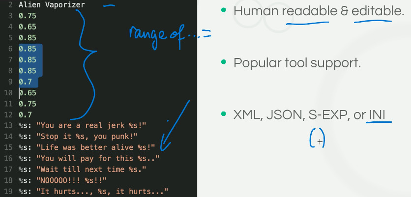

В-третьих,  помимо  именования  файлов,   необходимо  подумать  и  об  иерархии
директорий - не  будет же все лежать в одной!  Каких-то особых рекомендаций тут
нет, кто-то группирует по типу файлов, кто-то - по подсистемам, к которым файлы
относятся. Просто нужно выбрать наиболее подходящий вариант.

В-четвёртых,  имеет смысл  каждую сущность,  описанную  в том  или ином  файле,
снабдить  уникальным  идентификатором. Это  поможет  в  случаях, когда  имеются
какие-либо ссылки  между сущностями. Использовать  в качестве ссылки  имя файла
можно, но это не очень надёжно, так как довольно часто файлы могут перемещаться
с места на место, и это потребует поддержания ссылочной целостности. В качестве
варианта можно рассмотреть [UUID][].

В-пятых, необходимо  озадачиться вопросами  контроля версий.  Использование VCS
подразумевается как само  собой разумеющееся, потому в этом пункте  речь идёт в
первую очередь о  версиях форматов файлов. Движок  может поддерживать несколько
форматов одного и того же типа, и поэтому указание номера версии в явном виде в
начале  файла,  например,  может  весьма  ускорить  процесс  отладки  в  случае
возникновения проблем; о не поддерживаемых  версиях движок может сообщать сразу
же, при загрузке, а не в процессе исполнения.

Загрузка  игрового движка  может занимать  некоторое время.  С целью  уменьшить
время ожидания на перезапуск игры после модификации исходников must-have должна
быть поддержка движком горячей перезагрузки ресурсов, в том числе скриптов. Это
может быть реализовано как с помощью простого сочетания клавиш, так и с помощью
более  хитроумного  подхода  с  мониторингом файловой  системы.  Это  настолько
полезный  с точки  зрения экономии  времени подход,  что некоторые  движки даже
предоставляют возможность перекомпилировать исходный код и подгружать результат
компиляции на лету.

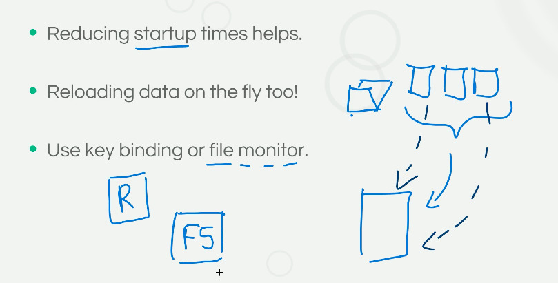

Зачастую  используется разделение  классов  неправильного  поведения на  ошибки
(errors)  и предупреждения  (warnings),  которые  просто печатаются  куда-либо.
Хорошей практикой является сведение  предупреждений к ошибкам, что способствует
тому, что их перестают игнорировать  (как зачастую бывает) - нужно воспринимать
данные  как  либо  валидные,  либо  нет. С  другой  стороны,  просто  прерывать
программу в случае  ошибки чревато потерями времени, и чем  больше команда, тем
существеннее эти потери. Альтернативой здесь может быть graceful degradation до
состояния, в котором можно продолжать работу.

На  период разработки  полезным может  быть использовать  очевидные и  заметные
плейсхолдеры для  отсутствующего контента  или каких-то  особенностей геймплея,
которые  необходимо трактовать  особым  образом.  Например, использовать  яркие
текстуры для  объектов, для которых  финальные текстуры  ещё не готовы.  Это не
позволит случайно  пропустить их перед  релизом, а тестировщикам -  понять, что
такое поведение ожидаемо, а не является багом.

При  внедрении   новых  фич  хорошей   практикой  считается  не   включение  их
по-умолчанию,  а   предоставление  флагов  конфигурации  для   их  активации  и
деактивации. Это позволит тестировать то, как интегрируются те или иные фичи, а
также  -  не прерывать  работу  других  членов  команды,  если у  них  возникли
проблемы.  Также не  рекомендуется одномоментно  удалять фичи  - вместо  этого,
лучше ввести некую  политику устаревания, сообщая об этом  с просьбой выключить
её, используя соответствующий механизм.  Особенно полезным является возможность
одновременного использования нескольких версий  одной фичи одновременно с целью
поиска визуальных различий.

Несмотря на удобство текстового  представления исходного контента, для игрового
движка  может быть  удобней и  быстрее работать  с бинарными  файлами -  просто
прочесть  файл  и  положить  его   в  память  без  дополнительных  манипуляций.
Соответственно, нам необходим этап конвертации - компиляции - исходных данных в
удобную для  движка форму, которая  происходит с помощью каких-то  утилит. Дабы
все ещё иметь возможность горячей загрузки контента, нам необходима возможность
иметь эти тулзы в рантайме - с кэшированием скомпилированных файлов или без.

В  случае, если  процесс  компиляции дорогостоящ,  можно  рассмотреть подход  с
центральным  хранилищем скомпилированных  ассетов,  доступных  для всех  членов
команды по уникальному идентификатору - например, по хэшу.

## 2.3 Алгебра для генерации контента

Для  целей   генерации  контента   с  помощью  алгебры   используются  функции.
Функции   -  это   описание   отношений  между   входными   параметрами  и   их
результатом. Функциональное программирование является естественной связью между
математическими функциями и их использовании  с помощью компьютера. Нас главным
образом интересуют [непрерывные функции][continuous-functions], то есть функции
без  "скачков". Их  можно использовать  в  различных областях  - для  генерации
звуковых сигналов,  модификаторов движений и анимации,  факторами, влияющими на
принятие решений,  для генерации текстур и  ландшафтов и так далее.  В функциях
чаще всего нам интересны их очертания - зная, как функция отвечает на изменения
аргумента, мы сможем понять, в каких случаях  лучше применить одну, а в каких -
другую.  Существует множество  типов функций  - помимо  простых и  примитивных,
таких как  identity и  линейная функции,  существуют квадратичные  и кубические
функции, функции инверсии, экпоненциальные, логарифмические, тригонометрические
(sin, cos) функции, и, часто имеющие применение в машинном обучении, сигмоида и
softplus.

Помимо прочего, можно комбинировать функции  друг с другом, используя привычные
математические  операторы сложения,  вычитания, умножения  и деления,  создавая
функцию с новыми свойствами и графиком,  который более применим в стоящей перед
нами задаче.

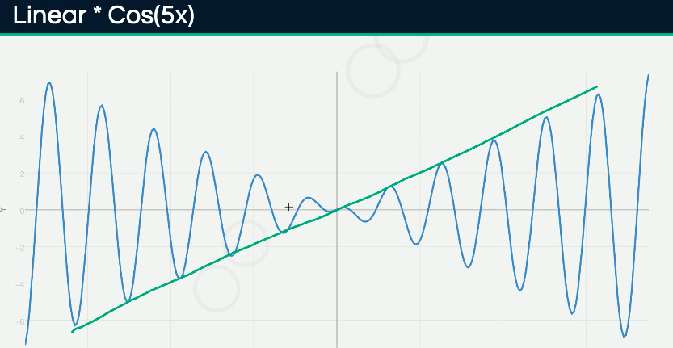

Новым  направлением в  генерации контента  (в том  числе компьютерной  графики)
является использование distance fields.  При использовании этого подхода вместо
расположения внешнего объекта, например игровой модели, состоящей из полигонов,
используется функциональный подход, и каждая точка нужной модели вычисляется на
основе входной точки и какой-то сложной формулы. Дублирование и вращение данных
объектов выполняется определёнными преобразованиями над входным вектором точек.
Такой подход можно применять для  генерации ландшафта a-la Minecraft, например,
начав с простого шара и затем итеративно добавлять все новые и новые функции, с
каждой приближаясь к требуемому результату.

Незаменимым  классом  функций  являются  функции генерации  шума  (noise).  Они
используются,  чтобы  добавить  некий   эффект  случайности  и  уникальность  к
автоматически  сгенерированному контенту.  Типичный  способ создать  шум -  это
начать  с синусоиды  и добавлять  новые слои  путём применения  каких-то других
функций с помощью различных операторов.  И, хотя некий паттерн в результирующем
графике можно  увидеть, тот или иной  его сегмент графика вполне  себе обладает
уникальностью и  может быть  использован для  практических целей  - модификации
текстуры, генерации ланшафта и так далее.

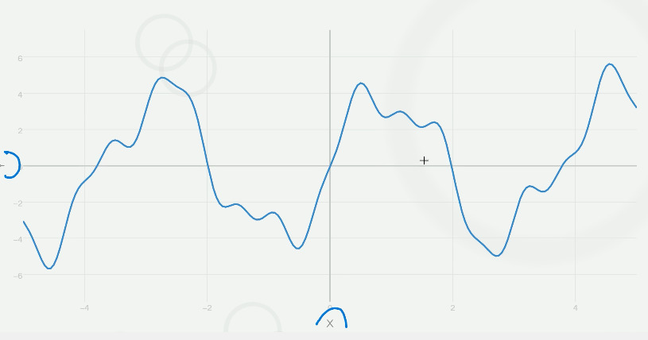

Самым популярным примером является [шум Перлина][perlin-noise].

[UUID]: https://ru.wikipedia.org/wiki/UUID
[continuous-functions]: https://ru.wikipedia.org/wiki/Непрерывная_функция
[perlin-noise]: https://ru.wikipedia.org/wiki/Шум_Перлина

* * *

# Третий урок

В данном уроке рассматриваются вопросы представления данных, обрабатываемых
интерактивными агентами: структуры данных, алгоритмы и так далее.

## 3.1 Представления

Для  того,  чтобы  думать  и  принимать  решения,  машине  необходимо  каким-то
образом  хранить  и  обрабатывать  ту  или  иную  информацию  о  внешнем  мире.
Вопрос представления информации  является одним из самых  важных при разработке
интерактивных агентов, да и вообще любой системы, потому что компьютеры никогда
не оперируют ничем, кроме информации в цифровом виде.

По   сравнению  с   классическим  академическим   ИИ,  где   для  представления
информации о  мире оперируют  в основном символами  и логикой  первого порядка,
в  робототехнике  акцент  смещён  в сторону  реальных  (непрерывных)  значений,
поскольку окружающий  мир не  является дискретным. Компьютерные  игры находятся
где-то посредине между двумя этими  категориями, активно используя и комбинируя
подходы из обеих областей.

Для  построения моделей  реального  мира используют  структуры данных,  которые
получаются путём  комбинирования скалярных  значений того  или иного  типа. Для
представления информации  придумано огромное количество структур  данных, в том
числе специфичных и для ИИ. Обычно  принято делить типы данных в зависимости от
объёма хранимых в них значений, например,  char, int16, float32 и так далее. Но
при разработке интерактивных агентов чаще принята другая классификация.

Для целей символьного представления данных типы делятся на следующие.

Это, во-первых, *символы* - уникальные идентификаторы какого-то концепта внутри
игры  о  котором, как  предполагается,  может  размышлять интерактивный  агент.
Примерами могут служить: `mana`, `health`, `door-B03`, `DRIVER_07` и так далее.

Следующие на  очереди - *булевы  значения*, которые, помимо  привычных значений
`истина`  и `ложь`,  в  применении к  ИИ могут  иметь  значение `неизвестно`  в
случаях, когда  о каком-то факте нельзя  сказать, истинен он или  ложен. Служат
эти типы значений,  как нетрудно догадаться, для  запоминания агентами каких-то
внутриигровых фактов.

И, наконец, *целые числа*, которые можно считать частным случаем типа "символ".
Применяются эти значения  практически повсеместно - в  счётчиках, информации об
уровне  соперника, для  подсчёта очков  и так  далее, перечислять  все варианты
применения просто бессмысленно.

Для представления  числовых данных  используются описанная  ниже классификация.
Практически  все эти  типы являются  числами с  плавающей точкой,  потому порой
возникает путаница с  определением того, к какому классу относится  то или иное
значение.

*Вспомогательные   значения  (utility   values)*   используются  для   хранения
информации  о  степени  предпочтительности  чего-либо по  сравнению  с  другими
вариантами  в списке.  Например,  число, характеризующее  пригодность того  или
иного местоположения для  того, чтобы спрятаться от  игрока, является значением
вспомогательного типа; соответственно, интерактивный  агент хранит эти значения
для того, чтобы позже сделать выбор о том, где укрыться.

Для  целей нечёткой  логики  используются *нечеткие  символы (fuzzy  symbols)*,
которые описывают степень истинности некоторого предположения - например, того,
успел  ли увидеть  игрок  агента, пока  тот прятался.  Эти  значения похожи  на
показатели  вероятности, мы  можем  увеличивать или  уменьшать  их значения  на
основе каких-то фактов.

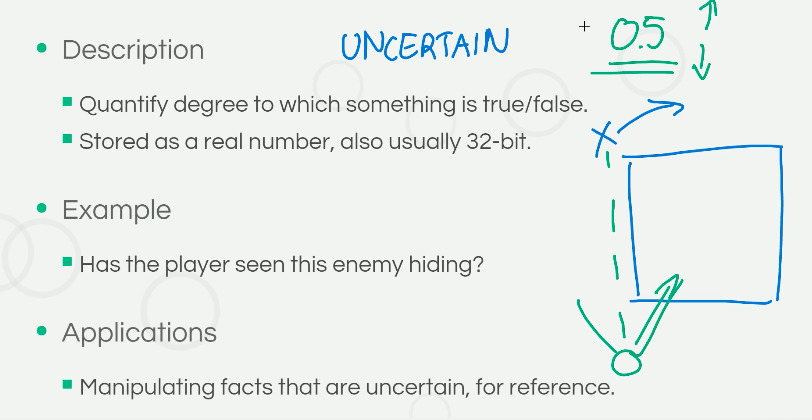

Значения, описывающие степень *вероятности* наступления того или иного события,
и заключены они  между нулём и единицей. В отличии  от нечётких символов данные
значения используются  для описания  ситуаций, наступление которых  ожидается в
будущем; для того,  чтобы пытаться предсказать, какое  поведение будет наиболее
вероятным при тех или иных событиях; для спекулятивных рассуждениях о возможных
ситуациях в будущем при построении дерева принятия решений.

В  качестве   примера  можно  рассмотреть   то,  как  будет   покидать  укрытие
интерактивный агент: выпрыгнет ли он на врага если тот достаточно близко или же
убежит в  другую сторону. То  есть, в отличии  от нечётких символов,  событие -
покинуть укрытие - обязательно наступит в  будущем, но каким способом оно будет
достигнуто, зависит от степени вероятности.

Из  всех  перечисленных  выше  простых типов  данных  строятся  более  сложные,
составные типы,  называемые структурами  данных. Сейчас мы  рассмотрим наиболее
популярные из них.

На  первом  месте,  разумеется,  идут  *списки* -  одно-  или  двусвязные.  Эта
структура данных характеризуется  простотой реализации, отсутствием ограничений
на  объем  и применяется  для  хранения  часто меняющихся  коллекций  различных
элементов. Имеет  низкую стоимость  вставки, но  пробегаться по  всем элементам
является  более  дорогой  операцией,  потому не  рекомендуется  использовать  в
случаях, когда это требуется часто.

*Словари*, структура данных, индексирующая информацию по ассоциированному с ней
ключу, используются для динамических  коллекций ради высокой скорости получения
связанного объекта  по какому-то значению,  так как вместо  поиска используется
хэширование.

Статические  *массивы*, имея  свойства, характерные  спискам, используются  для
хранения  данных одного  типа, которые  часто требуется  обходить в  цикле. Они
имеют большую  скорость для этой задачи,  потому как данные размещены  в памяти
непрерывно, но  в качестве минусов  есть необходимость знать размер  массива до
его создания и невозможность этот размер менять. *Многомерные массивы* обладают
теми  же  характеристиками,  так  как  строятся  на  основе  обычных  массивов,
и  используются  чаще  всего  для хранения  информации  о  многомерном  игровом
пространстве.

*Графы*,  используемые для  описания отношений  между своими  элементами, могут
быть как динамически  расширяемыми, так и статическими, в  зависимости от того,
на основе  чего они реализованы  - на основе  списков или же  массивов. Частным
случаем графа является  *дерево*: обладает теми же преимуществами,  что и граф,
но, так  как не  предполагает циклов, используется  для хранения  информации об
иерархических данных - описания  родственных отношений, декомпозиции объектов и
так далее.

## 3.2 "Школьные доски" и "рабочая память"

В   данном   разделе   идёт   обсуждение   способов   организации   архитектуры
интерактивного агента. Рассматриваются такие компоненты, как *blackboard*, или,
по-русски, школьная доска, и *working memory*, или рабочая память.

Школьная  доска  -  это  перевод   термина  [blackboard][].  Если  смотреть  на
архитектуру интерактивного агента в  целом, может показаться, что концептуально
"рабочая память"  и "школьная доска"  абсолютно идентичны. Тем не  менее, между
ними существуют некоторые различия.

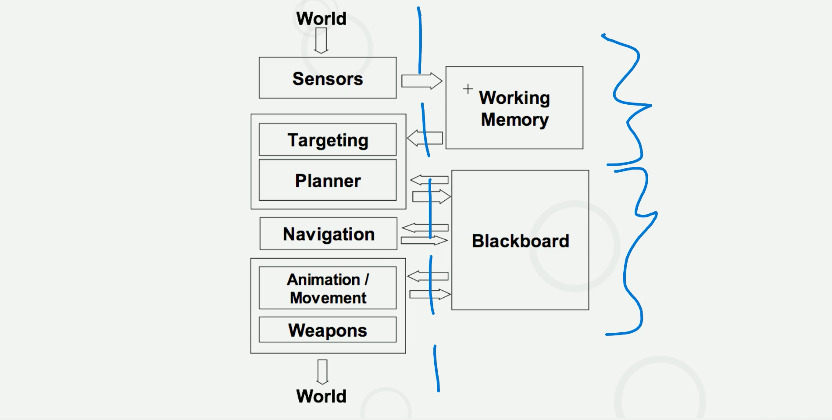

Принцип  "школьной  доски"  весьма [прост][blackboard-system].  У  нас  имеется
несколько компонентов,  каждый из  которых имеет  доступ к  какой-то структуре,
которая  и называется  blackboard. Некоторые  компоненты оттуда  только читают,
некоторые  - пишут,  а некоторые  делают и  то, и  другое. Предполагается,  что
"школьная  доска"  разделяются  между экземплярами  компонентов  только  одного
интерактивного агента, то есть разные агенты имеют для своих нужд разные доски.

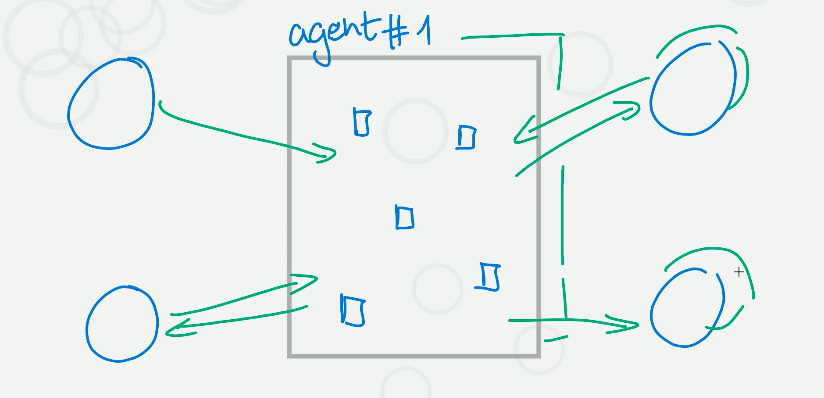

Для реализации "школьной доски"  обычно используются структуры данных, подобные
словарям, то  есть с обращением  к данным по  имени, которые, в  зависимости от
нужд,  могут  быть как  динамическими  (собственно,  `dict`  в Python),  так  и
статическими (`struct`  из C). В  качестве значений могут храниться  любые типы
данных - как скалярные, так и составные.

Каждая информационная  система, и интерактивный агент  не являются исключением,
требует взаимодействия  модулей, из которых  она состоит, обмена  данными между
ними, но  при этом должна стремиться  к уменьшению [сцепленности][сцепленность]
между  модулями, чтобы  разработка и  поддержка системы  не превратилась  в ад.
Blackboard  отчасти решает  эту задачу,  потому как  предоставляет механизм,  в
котором *n-to-n* связи между различными компонентами заменяются на *n* связей к
центральному звену, собственно, и являющемся школьной доской.

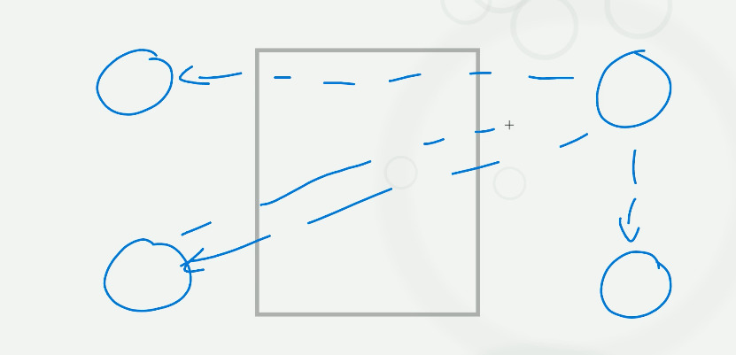

Для тех, кто  знаком с паттернами проектирования  "одиночка" (singleton), можно
сказать, что blackboard является неким его  аналогом, но не глобальным в рамках
всей системы, а только для компонентов каждого интерактивного агента.

Обычно "школьные  доски" используют для  того, чтобы шарить  между компонентами
конфигурационные  переменные, переменные  рантайма  и  использовать в  качестве
механизма обмена сообщениями или уведомления/подписки на некоторые события.

Blackboard  является общим  для  компонентов с  различных  слоев, или  уровней,
информационного агента.  Например, компонент с уровня  обнаружения столкновений
может  поместить информации  о  препятствии на  доску,  а более  низкоуровневый
механизм анимаций узнать об этой информации и отреагировать должным образом.

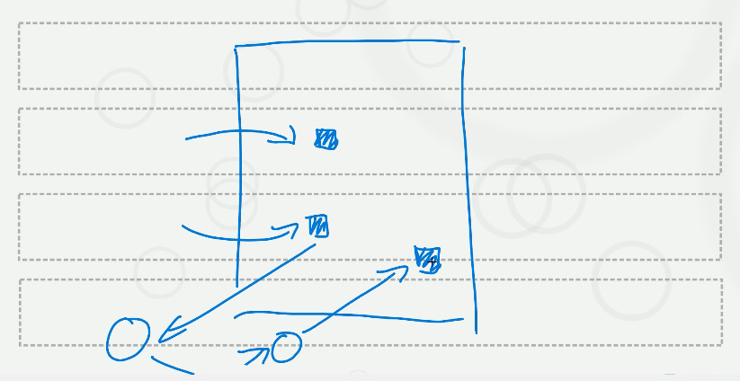

Итак, преимуществами "школьных досок" являются:

1. Возможность  легко провести  поверхностный обзор  состояния агента,  то есть
составить представление о том, чем агенту предназначено заниматься

2. Простой механизм добавления неких глобальных переменных уровня агента

3.  Архитектура становится  чуточку более  модульной за  счёт разрыва  *n-to-n*
связей

При этом к недостаткам относятся:

1.  Трудность масштабирования  и  возможностей параллельной  обработки за  счёт
того, что доска  является разделяемым ресурсом и нужно  следить за очерёдностью
доступа к ней

2.  Централизация всего  не  всегда  является хорошим  решением  - например,  в
случае, когда различных  компонентов слишком много, в  плане модульности подход
со "школьной доской" не сильно лучше *n-to-n* связей

3.  Как дополнение  ко второму  пункту, с  увеличением количества  использующих
доску компонентов становится  сложно контролировать кто, когда  и каким образом
использует  те или  иные значение,  то  есть теряется  контроль над  состоянием
системы

Тем   не  менее,   не   смотря  на   недостатки,   "школьные  доски"   являются
удовлетворительным архитектурным решением для обмена статически типизированными
данными между компонентами.

Термин  "рабочая   память"  пришёл  из   психологии,  где  так   называется  та
кратковременная  память,  что отвечает  за  хранение  информации на  период  её
обработки.  Исследования показывают,  что  в среднем  человек  может хранить  в
рабочей области  не более  семи фактов,  но для  нужд интерактивных  агентов мы
вольны использовать столько слотов, сколько необходимо.

Концепция  рабочей памяти  тесно связано  с так  называемой "моделью  мира", то
есть  представлением  конкретного агента  об  окружающем  мире, его  ментальной
моделью,  которая не  идентична  реальному положению  вещей.  Подход с  моделью
мира  замечателен   тем,  что   он  предоставляет   возможность  манипулировать
"сознанием" интерактивного  агента и,  соответственно, его  поведением довольно
простым  способом, создавая  весьма человекоподобное  поведение. Например,  без
использования модели мира  солдат в каком-нибудь шутере наверняка  знает о том,
где находится пользователь,  и его поведение теряет реалистичность.  Если же мы
внедрим прослойку в  виде ментальной модели между реальным  миром и "сознанием"
агента, мы можем, добавив в эту  прослойку "факт" (который может быть и ложным,
но в котором агент будет абсолютно уверен), что игрок находится за дверью - это
заставит солдата  подойти к  двери с  осторожностью или  даже выпустить  по ней
очередь.

Итак, механизм  рабочей памяти и  модели мира, отдельной от  реальной, обладает
следующими преимуществами:

1. Возможность  простой подмены фактов  о мире для каждого  конкретного агента,
что заставит агентов "верить" в их истинность

2. Реализация более высокоуровневого, сложного и реалистичного поведения

3.  Отсутствие необходимости  использовать специальные  алгоритмы для  создания
реалистичного поведения

4.  Как  и  в  случае  с   blackboard,  через  механизм  рабочей  памяти  могут
взаимодействовать несколько компонентов

Так как  реализация рабочей памяти  похожа на реализацию "школьной  доски", она
обладает  и  схожими  проблемами.  Есть несколько  способов  реализации  данных
механизмов, которые предназначены для борьбы с возникающими сложностями.

При  разработке   архитектуры  этих  механизмом  необходимо   принять  решения,
согласившись на компромиссы, по следующим пунктам:

1. Централизация/распределенность

2. Статичность/динамичность

3. Время жизни объектов

4. Поток управления - синхронный/асинхронный

Прежде  всего,  для  борьбы  со сложностью  масштабирования,  в  случае,  когда
компонентов или слотов  для записей на доске очень много,  имеет смысл выделить
несколько  различных "областей"  внутри общей  доски, или  "поддосок", значения
в  которых  будут сгруппированы  по  тому,  какими компонентами  они  совместно
используются.

По  поводу  статичности либо  динамичности  механизма  можно сказать,  что  под
статичностью тут, с одной стороны, имеется ввиду разрешение только определённых
ключей  на доске,  а  с  другой, ограничение  на  хранимые значения,  например,
разрешение хранить значения только определённого  формата. При работе в больших
командах имеет смысл  делать упор на большую строгость и  статичность; с другой
стороны, динамичность увеличивает гибкость системы.

Контроль за хранимыми на доске значениями,  то есть их удаление в нужное время,
является  важным  вопросом,  поскольку  некорректное  поведение  интерактивного
агента по  статистике чаще всего  связано с  тем, что он  оперирует устаревшими
фактами - например, объект  уже удалён из мира, но ссылка на  доске на него все
ещё присутствует. В  качестве решений существуют использование  времени жизни у
каждого значения,  периодическая их очистка или  же использование своеобразного
сборщика мусора - например, с подсчётом ссылок.

Вопрос контроля  потока управления тесно  связан с контролем за  временем жизни
значений.  Преимущества  и  недостатки  прямого и  асинхронного  контроля  были
описаны  в предыдущем  уроке.  Вкратце, можно  сказать,  что при  использовании
синхронного  подхода  на  каждом  этапе  вычислений  значения,  добавленные  на
предыдущем шаге,  остаются доступными для  обработки, а в случае  с асинхронным
подходом необходим  некий механизм  оповещений о  добавлении/изменении значения
(observer/callback).

При  разработке  и  отладке  системы со  столь  слабо  связанными  компонентами
подспорьем является наличие хорошей  системы логирования. Идеально, если каждое
изменение значения на доске будет ассоциировано с информацией о том, откуда оно
пришла, в  какое время (timestamp),  а в  случае, если ожидалось,  что значение
присутствует  на  доске,  но  оно  отсутствовало, информация  о  том,  кто  его
запрашивал.  Данную систему  несложно добавить,  используя, например,  механизм
метапрограммирования.

# 3.3 Пространственная геометрия

Главными проблемами,  возникающими при работе над  пространством в компьютерных
играх,  является то,  что реальный  мир, эмуляция  которого происходит  в игре,
обладает характеристиками,  которые сложно реализовать  в игре. Прежде  всего к
этому  относится: непрерывность  реального  мира (так  как компьютеры  способны
оперировать  только   дискретными  величинами);  высокая   степень  детализации
(множество  предметов,  узоров  и  так далее),  каждый  их  которых  необходимо
учитывать;  разный  ландшафт (в  то  время  как  в пустынном  ландшафте  высота
изменяется плавно, в горном возможны очень резкие переходы).

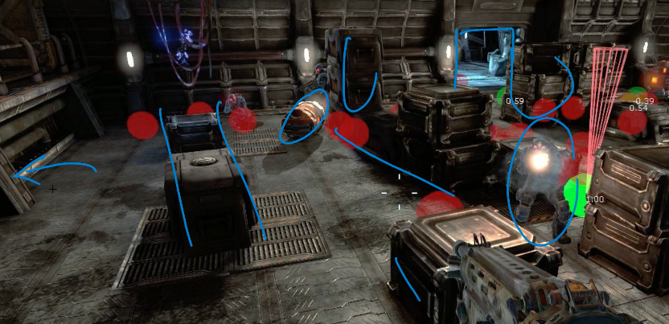

Как  следствие этого,  мы можем  строить только  некую аппроксимацию  реального
мира, его  приближение. Необходимо  балансировать между точностью  при описании
виртуального мира и производительностью.

Ещё  одной  сложностью является  то,  что  пространство должно  учитываться  во
всех  аспектах  работы интерактивного  агента,  будь  то  физика (в  том  числе
система обнаружения столкновений), анимация, навигация или же принятие решений.
Поэтому  необходимо  уделять особое  внимание  тому,  как различные  компоненты
взаимодействуют  с пространственной  подсистемой,  чтобы  различия в  трактовке
данных не приводили к трудноуловимым багам.

Вне зависимости от  выбранных структур данных, существует  несколько подходов к
работе с пространственной информации об  уровне. Первый их них - препроцессинг,
когда  "сырая" информация  о  структуре уровня,  полученная от  гейм-дизайнера,
преобразуется в  более подходящие структуры  данных, которые в  момент рантайма
просто  читаются  и не  изменяются  по  ходу  игры.  Другой подход  -  получать
информацию  о  структуре  уровня  в  момент  работы  игры:  медленней,  но  для
высокодинамичных  игр иной  подход применить  сложно. Комбинированный  вариант,
своего  рода баланс  между динамичностью  и производительностью  - это  сделать
возможность в рантайме расширять генерируемые заранее статические структуры.

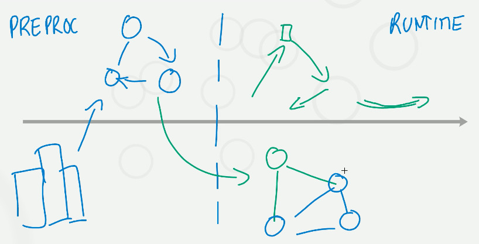

Вопрос  о  том,  какую  структуру  данных выбрать  для  представления  той  или
иной пространственной  информации делится  на две  части: на  выбор примитивов,
описывающих  информацию, и  контейнеров, в  которых они  будут содержаться.  Не
исключено, что ту же информацию  ради целей производительности будет необходимо
предоставить и в другом виде - потому  что потребители у неё могут быть другие.
Это не  возбраняется и является вполне  естественным - в таком  сложном вопросе
вполне удачным решением является создания какой-либо кастомной структуры данных
на основе примитивов.

Итак,  основными   примитивами,  которые  описывают  одну   дискретную  область
пространства, являются следующие.

*Точки, круги, сферы*. Представлены они могут быть двумя или тремя параметрами.
Круг  или  сфера  получаются  добавлением ещё  одного  параметра,  описывающего
радиус. К преимуществам  данного примитива можно отнести  простоту реализации и
вместе с  тем её  гибкость, а  также неплохое  покрытие пространства:  в случае
проблем с покрытием всегда можно добавить новых точек или сфер, уменьшив радиус
у остальных.

*Ячейки и прямоугольники*. Представляются, опять  же, двумя или тремя точками в
зависимости от того,  скольки-мерное пространство используется в  игре, а также
параметром,  описывающим  размер  (в  каждом  направлении,  если  речь  идёт  о
прямоугольнике). Главным преимуществом является отличное покрытие пространства,
поскольку ячейки вплотную прилегают друг к другу.

Полигоны.  Представляются в  машине вершинами,  каждая из  которых представлена
тремя точками, а  также рёбрами (*a*, *b*), описывающими связи  между каждой из
точек.  Они  весьма часто  используются  по  причине их  эффективного  покрытия
пространства  малым  количеством  элементов: можно  покрыть  любую  поверхность
комбинацией полигонов, используя  тот или иной размер и  в случае необходимости
повысить детализацию.

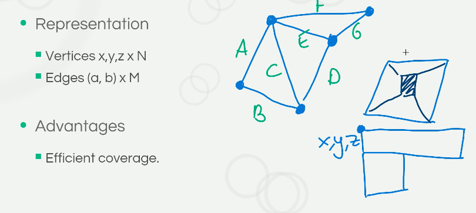

Контейнеры,  предназначенные для  хранения примитивов  - это  обычные структуры
данных,  которые  в  случае   необходимости  можно  расширить.  Используются  в
зависимости от  того, какая  задача решается  с их  помощью.

*Массивы и  списки*. Хотя списки  практически не используются по  причине того,
что  к элементам  чаще  всего требуется  одновременный,  а не  последовательный
доступ.

Применяются  они  тогда,  когда  требуется хранить  набор  каких-то  элементов,
относящихся к  той или  иной области пространства:  например, точек,  в которых
можно сделать укрытие.

*Графы*.  Используются, когда  необходимо  описать то,  как различные  элементы
между собой связаны, то есть хранят  помимо самих элементов связи между ними. К
примеру, в них можно хранить навигационные  данные или данные о видимости одних
зон из других.

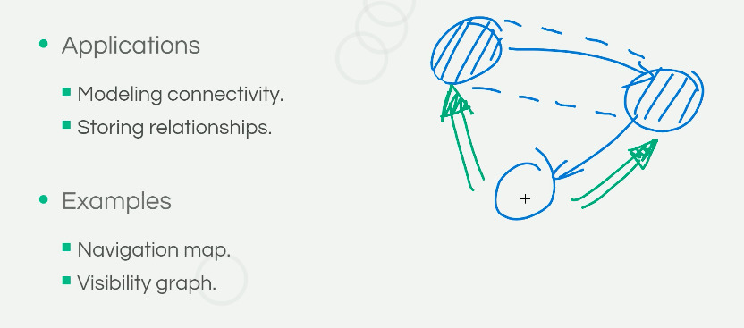

Сетка  используется, когда  необходимо разделить  весь мир  на равные  участки.
Так  как сетка  является матрицей,  ими можно  манипулировать очень  эффективно
используя, например, GPU. Применяется,  когда необходимо описать, какое влияние
оказывается на  окружающий мир каким-либо  игровым объектом; объект  чаще всего
находится в центре этой сетки.

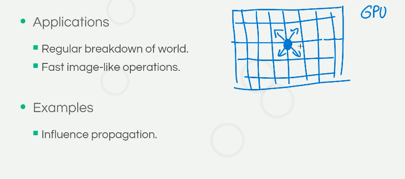

Деревья   используются   для   иерархичного   разбиения   пространства.   Могут
применяться  во многих  случаях  за  счёт быстрого  доступа  к любому  элементу
(см.   [Potentially   visible  set][potentially-visible-set],   [Binary   space
partitioning][binary-space-partitioning]).

Как уже  было сказано,  не существует  структуры для  хранения пространственных
данных или  алгоритма, которые  были бы универсальными  или подходили  для всех
случаев.  Чаще  всего  за  базу берётся  какая-то  уже  существующая  структура
или  алгоритм,   которые  затем  итеративно  улучшаются,   чтобы  лучше  решать
какую-то конкретную  задачу - исходная  структура данных может не  подходить по
производительности, по степени покрытия пространства и так далее. В зависимости
от  задачи для  улучшения базы  можно  менять количество  узлов, какие-либо  их
характеристики, группировать и так далее.

Примером  может  служить  задача  вокселизации пространства.  Сырые  данные  об
уровне, пришедшие от дизайнера  уровней, сперва покрываются непрерывной сеткой,
а затем специальный алгоритм разбивает их на минимальное количество вокселей.

Другим  примером может  являться  задача по  объединению  локаций на  некотором
уровне в крупные кластеры с целью использовать их как опорные точки для раздачи
команд  интерактивным  агентам.   Здесь  происходит  постепенная  кластеризация
близлежащих локаций, пока не будет достигнут некий предел.

[blackboard]: https://en.wikipedia.org/wiki/Blackboard_(design_pattern)
[blackboard-system]: https://en.wikipedia.org/wiki/Blackboard_system
[сцепленность]: https://ru.wikipedia.org/wiki/Зацепление_(программирование)
[potentially-visible-set]: https://en.wikipedia.org/wiki/Potentially_visible_set
[binary-space-partitioning]: https://en.wikipedia.org/wiki/Binary_space_partitioning
